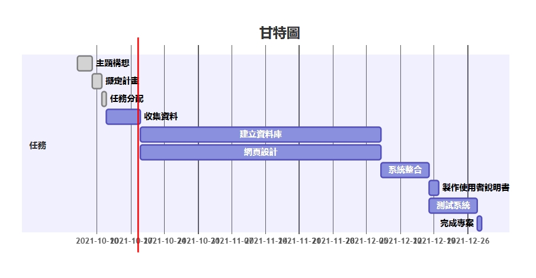
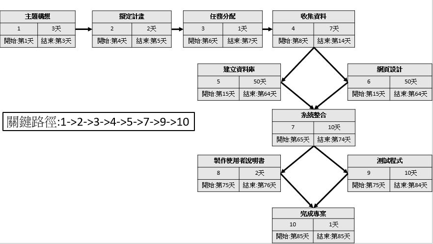
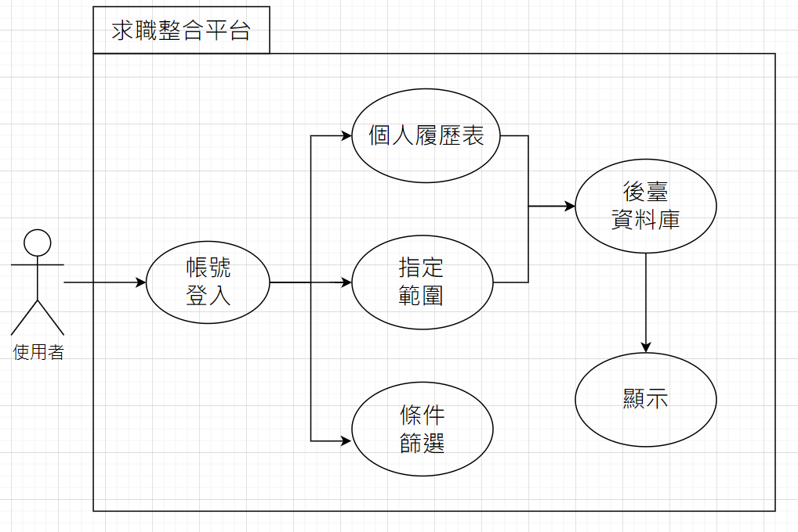

# NKUST_Group10
 |        學號      |       姓名         |  
 | :-------------: | :-------------: |  
 | C108118233 | 劉家寧(組長)      |  
 | C108118202 | 陳文彥            |  
 | C108118220 | 羅欣寶            |  
 | C108118232 | 林楓竣            |  
 | C108118238 | 陳楷軒            |  
 | C108118249 | 林沛晴            |  
---
> # 題目：求職整合平台
>> ## 內容：    

---
## 分工：   

---
## 甘特圖
   
[甘特圖](https://hackmd.io/@isLy0nG2SxyJIpSQVodlwA/BJr2Os9HY)

## PERT/CPM圖

   
---   
## 功能性需求：
1. 依照條件的職缺顯示 (排序)
2. 有條件設定的職缺搜尋 (篩選)
3. 範圍指定的職缺搜尋 (定位)   

## 非功能性需求：
1. 反應時間：1筆資料1分鐘內
2. 使用性：使用容易
3. 可靠度：高，使用者不能隨意修改網站內容
   
---
## 功能分解圖   
   
   ---
## 使用案例圖   
   

   ---
## 使用案例說明   
| 使用案例名稱	| 填寫個人履歷表 | 
| :------------- | :------------- | 
| 行動者	| 使用者 | 
| 說明	| 建立/更新個人履歷表 | 
| 完成動作	| 1.編輯個人資料 | 
| 替代方法	| 無 | 
| 先決條件	| 無 | 
| 後置條件	| 第一次填寫完畢後，之後查看&更新 | 
| 假設	| 無 |    

| 使用案例名稱	| 指定距離範圍 | 
| :------------- | :------------- |  
| 行動者	| 使用者 | 
| 說明	| 描述使用者點擊「指定距離範圍」的過程 | 
| 完成動作	| 1. 使用者點擊選單上的「指定距離範圍」 2. 輸入縣市、區域 3. 系統將會顯示該範圍的公司資訊 | 
| 替代方法	| 1. 使用者點擊圖文選單上的「指定距離範圍」 2. 輸入縣市、區域 3. 系統傳送錯誤訊息 | 
| 先決條件	| 使用者必須先輸入「地區」 | 
| 後置條件	| 查詢完畢後，使用者可繼續查詢其他地區資訊 | 
| 假設	| 無 |    

| 使用案例名稱	| 依照條件篩選 | 
| :------------- | :------------- |  
| 行動者	| 使用者 | 
| 說明	| 描述使用者點擊「依照條件篩選」的過程 | 
| 完成動作	| 1. 使用者點擊選單上的「依照條件篩選」 2. 選擇職務、薪資 3. 系統將會顯示符合需求的公司資訊 | 
| 替代方法	| 1. 使用者點擊圖文選單上的「指定距離範圍」 2. 選擇職務、薪資 	3. 系統傳送錯誤訊息 | 
| 先決條件	| 使用者必須先選擇「職務」或「薪資」 | 
| 後置條件	| 查詢完畢後，使用者可繼續查詢其他職務或薪資需求 | 
| 假設	| 無 | 
